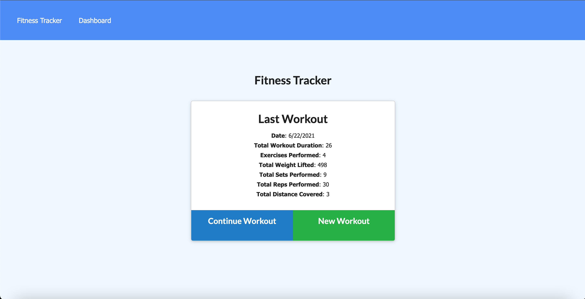
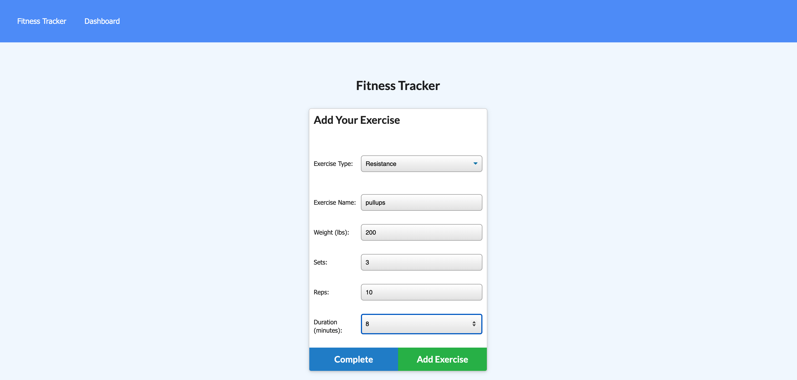
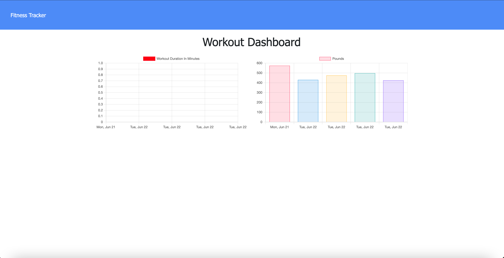

# Fitness Tracker Application
    
## Table of Contents
* [Description](#description) 
* [Installation](#installation)
* [Usage](#usage)
* [Credits](#credits)
* [License](#license)
* [Badge](#badge)
* [Questions](#questions)
    
## Description
* Fitness tracker application that tracks and logs an individual's workout progress.
    
## Installation
* online application with no installation needed.  Go to website with any appropriate browser to use application. 
    
## Usage
* Choose either Continue Workout or New Workout in the options on the main screen.  Enter your type, either resistance or cardio.  In the next screen, enter the details of the exercise performed such as duration, reps, weight, distance, etc.  After data has been entered, go to the dashboard in the upper left corner of the app and view the progress.

    
## Credits
* N/A
    
## License
* Licensed by mit
    
## Badge
* 
    
## Questions
* For any questions, concerns, or additional help, please contact klucas72@hotmail.com.
